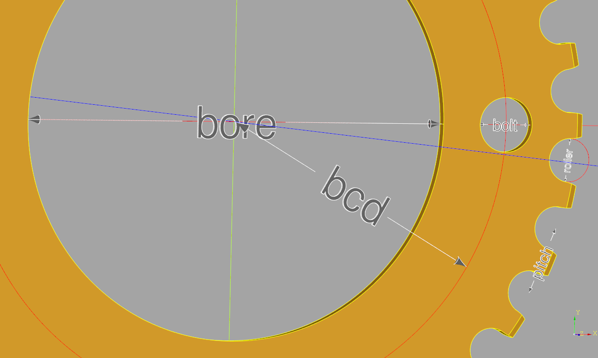

# Sprocket

This python/cadquery code is a parameterized sprocket generator.
Once provided with a few parameters a CAD model is generated which
can be easily saved in STEP or STL format for use in a wide variety of CAD
or CAM systems. Cadquery programmers can add further detail to the resulting
Workplane objects - for example, cutting custom
hole patterns into the sprocket - or add them to larger cadquery projects.

## Table of Contents
- [Sprocket](#sprocket)
  - [Table of Contents](#table-of-contents)
  - [Installation](#installation)
    - [Requirements](#requirements)
  - [Sprocket Class](#sprocket-class)
    - [Input Parameters](#input-parameters)
    - [Instance Variables](#instance-variables)
    - [Methods](#methods)
    - [Tooth Tip Shape](#tooth-tip-shape)
## Installation
TBD...
Install directly from github:
```
  $ git clone https://github.com/gumyr/Velomobile/tree/master/sprocketsAndChain
  $ cd
  $ python setup.py install
```
### Requirements
You need cadquery master to run sprocket_and_chain.
## Sprocket Class
A sprocket can be generated and saved to a STEP file with just four lines
of python code using the `Sprocket` class:
```python
import cadquery as cq
from sprocket_and_chain import Sprocket
sprocket32 = Sprocket(32)
cq.exporters.export(sprocket32.cq_object,"sprocket.step")
```
How does this code work?
1. The first line imports cadquery CAD system with the alias cq
2. The second line imports the Sprocket class from the sprocket_and_chain module
3. The third line instantiates a 32 tooth sprocket named <q>sprocket32</q>
4. The fourth line uses the cadquery exporter functionality to save the generated
sprocket object in STEP format

Note that instead of exporting sprocket32, sprocket32.cq_object is exported as
sprocket32 contains much more than just the raw CAD object - it contains all of
the parameters used to generate this sprocket - such as the chain pitch - and some
derived information that may be useful - such as the chain pitch radius.

### Input Parameters
Most of the Sprocket parameters are shown in the following diagram:



The full set of Sprocket input parameters are as follows:
```python
num_teeth : int
    """ the number of teeth on the perimeter of the sprocket (must be >= 3) """
chain_pitch : float = (1/2)*INCH
    """ the distance between the centers of two adjacent rollers (pitch in the diagram) """
roller_diameter : float = (5/16)*INCH
    """ the size of the cylindrical rollers within the chain (roller in the diagram) """
clearance : float = 0.0
    """ the size of the gap between the chain's rollers and the sprocket's teeth """
thickness : float = 0.084*INCH
    """ the thickness of the sprocket """
bolt_circle_diameter : float = 0.0
    """ the diameter of the mounting bolt hole pattern (bcd in the diagram) """
num_mount_bolts : int = 0
    """ the number of bolt holes - if 0, no bolt holes are added to the sprocket """
mount_bolt_diameter : float = 0.0
    """ the size of the bolt holes use to mount the sprocket (bolt in the diagram) """
bore_diameter : float = 0.0
    """ the size of the central hole in the sprocket - if 0, no bore hole is added to the sprocket (bore in the diagram) """
```
---
**NOTE**
Default parameters are for standard single sprocket bicycle chains.

---
The sprocket in the diagram was generated as follows:
```python
MM = 1
chain_ring = Sprocket(
    num_teeth = 32,
    clearance = 0.1*MM,
    bolt_circle_diameter = 104*MM,
    num_mount_bolts = 4,
    mount_bolt_diameter = 10*MM,
    bore_diameter = 80*MM
)
```
---
**NOTE**
Units in cadquery are defined so that 1 represents one millimeter but `MM = 1` makes this
explicit.

---
### Instance Variables
In addition to all of the input parameters that are stored as instance variables
within the Sprocket instance there are four derived instance variables:
```python
pitch_radius : float
    """ the radius of the circle formed by the center of the chain rollers """
outer_radius : float
    """ the size of the sprocket from center to tip of the teeth """
pitch_circumference : float
    """ the circumference of the sprocket at the pitch rad """
cq_object : cq.Workplane
    """ the cadquery sprocket object """
```
### Methods
The Sprocket class defines two static methods that may be of use when designing with
systems with sprockets: calculation of the pitch radius and pitch circumference as follows:
```python
@staticmethod
def sprocket_pitch_radius(num_teeth:int, chain_pitch:float) -> float:
    """
    Calculate and return the pitch radius of a sprocket with the given number of teeth
    and chain pitch

    Parameters
    ----------
    num_teeth : int
        the number of teeth on the perimeter of the sprocket
    chain_pitch : float
        the distance between two adjacent pins in a single link (default 1/2 INCH)
    """

@staticmethod
def sprocket_circumference(num_teeth:int, chain_pitch:float) -> float:
    """
    Calculate and return the pitch circumference of a sprocket with the given number of
    teeth and chain pitch

    Parameters
    ----------
    num_teeth : int
        the number of teeth on the perimeter of the sprocket
    chain_pitch : float
        the distance between two adjacent pins in a single link (default 1/2 INCH)
    """
```
### Tooth Tip Shape
Normally the tip of a sprocket tooth has a circular section spanning the roller pin sockets
on either side of the tooth tip. In this case, the tip is chamfered to allow the chain to
easily slide over the tooth tip thus reducing the chances of derailing the chain in normal
operation. However, it is valid to generate a sprocket without this <q>flat</q> section by
increasing the size of the rollers. In this case, the tooth tips will be <q>spiky</q> and
will not be chamfered.